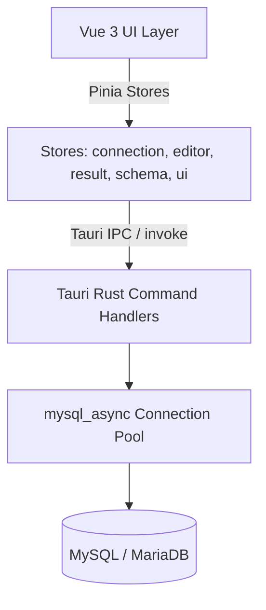

# Select ⚡

**Select** is a fast, lightweight, local-first MySQL and MariaDB GUI desktop client engineered with **Tauri v2**, **Vue 3**, **TypeScript**, and **Rust**.

Designed as a modern, high-performance alternative to legacy database tools, Select delivers instant startup, sub-millisecond UI interactions, rich schema visualization, and built-in safety controls.

---

## Key Features

- **⚡ Blazing Fast Architecture**: Native Rust backend powered by `tokio` and `mysql_async` with connection pooling and query cancellation support.
- **🛡️ Multi-Tier Safety & Read-Only Protection**:
  - Connection-level read-only mode enforced on both frontend and Rust backend.
  - Destructive query safeguards and warnings for unconstrained write operations.
  - Parameterized updates to prevent injection vulnerabilities.
  - Secure credential storage encrypted with AES-256-GCM.
- **📊 Interactive Schema Visualizer**: Interactive canvas to visualize table relationships, foreign key constraints, column types, and schema dependencies.
- **📝 CodeMirror 6 SQL Editor**:
  - Context-aware autocomplete for SQL keywords, database schemas, tables, and columns.
  - Multi-query statement execution with per-statement results.
  - One-click SQL formatter and query execution plan (`EXPLAIN`) visualization.
- **🗃️ Full Data Grid & Cell Editor**:
  - Live in-place cell editing with dirty-state tracking and undo (`Cmd+Z`).
  - Foreign key hover inspection and referenced row previews.
  - High-performance paged streaming with custom page sizes (50–500 rows).
  - Quick export to CSV and TSV (Excel-compatible).
- **📌 Query Result Pinning**: Pin multiple result tabs side-by-side with local session persistence.
- **🎨 Modern Dark & Light Themes**: Curated theme palettes with seamless switching.

---

## Tech Stack

| Layer | Technologies |
|-------|--------------|
| **Core Desktop Engine** | [Tauri v2](https://tauri.app/), Rust, `mysql_async`, `tokio`, `aes-gcm` |
| **Frontend Framework** | [Vue 3](https://vuejs.org/) (Composition API, `<script setup>`), TypeScript |
| **State Management** | [Pinia](https://pinia.vuejs.org/) |
| **Styling & Components** | [Tailwind CSS](https://tailwindcss.com/), Radix UI / shadcn-vue, Lucide & Phosphor Icons |
| **Editor** | [CodeMirror 6](https://codemirror.net/) |
| **Build & Test** | Vite, Vitest, Cargo |

---

## Getting Started

### Prerequisites
- **Node.js**: >= 18
- **Rust & Cargo**: >= 1.75
- **OS**: macOS, Linux, or Windows

### Development Setup

1. **Clone the repository**:
   ```bash
   git clone https://github.com/hitesh103/select.git
   cd select
   ```

2. **Install dependencies**:
   ```bash
   npm install
   ```

3. **Run in development mode**:
   ```bash
   npm run tauri dev
   ```

4. **Run test suites**:
   ```bash
   # Run frontend unit tests
   npm test

   # Run backend Rust tests
   cargo test --manifest-path src-tauri/Cargo.toml
   ```

5. **Build production bundle**:
   ```bash
   npm run build
   npm run tauri build
   ```

---

## Architecture Overview



---

## Local Data & Storage

| Data | Location | Notes |
|------|----------|-------|
| **Connections** | Tauri plugin store (`select-store.json`) with localStorage fallback via `src/stores/storage.ts` | Passwords are sealed in Rust (`seal_connections_for_storage`) before persistence; never stored as plaintext |
| **Query history** | App data dir `query_history.json` | Cached in memory after first load; writes go through the in-memory cache |
| **Saved queries** | App data `queries/` folder (or custom directory) | Cached in memory; invalidated on save/rename/delete |
| **Pinned results** | `localStorage` (`select_pinned_results`) | Up to 10 pinned result tabs |
| **UI preferences** | `localStorage` (theme, sounds, panel layout) | Restored on startup |

---

## License

MIT License. See [LICENSE](LICENSE) for details.
