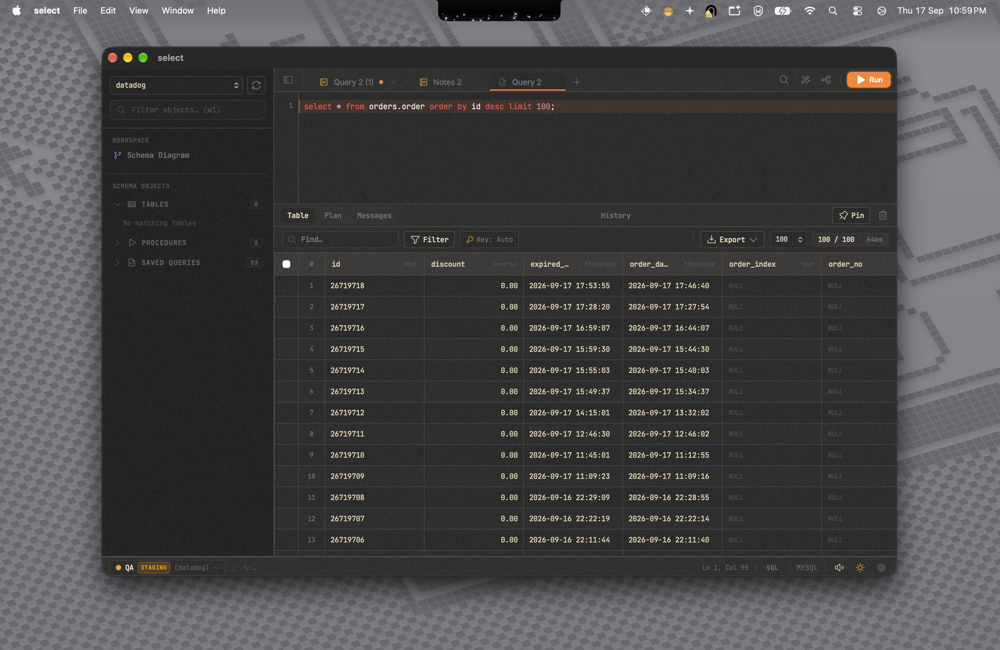

# Select

A fast, local-first MySQL and MariaDB desktop client built with Tauri v2, Vue 3, TypeScript, and Rust.



---

## Install Pre-built Binaries

Download the latest release for your platform from the [Releases](https://github.com/kzoldyk/select/releases) page.

### macOS (.dmg)

1. Download the `.dmg` file for your architecture (Apple Silicon or Intel).
2. Open the `.dmg` and drag `Select.app` to your `Applications` folder.
3. On first launch, macOS will block the app because it is unsigned (no Apple Developer ID certificate). Follow the steps below based on your macOS version.

#### macOS 15 Sequoia and later

In macOS Sequoia, Apple removed the right-click/Control-click shortcut for unsigned apps. You must use System Settings:

1. Double-click `Select.app` to try opening it. A dialog will say the app cannot be opened.
2. Click **OK** to dismiss the dialog.
3. Open **System Settings** > **Privacy & Security**.
4. Scroll all the way down to the **Security** section.
5. You will see a message: `Select was blocked from use because it is not from an identified developer`.
6. Click **Open Anyway** next to that message.
7. Enter your password or use Touch ID when prompted.

The app will now launch. This only needs to be done once.

If the **Open Anyway** button does not appear, try this terminal command first:

```bash
xattr -cr /Applications/Select.app
```

Then attempt to open the app again and check System Settings for the button.

#### macOS 14 Sonoma and earlier

On older macOS versions, you can use the right-click method:

1. In Finder, right-click (or Control-click) `Select.app` and choose **Open**.
2. A dialog will appear. Click **Open**.

#### Alternative: Remove quarantine flag (all versions)

This bypasses Gatekeeper without going through System Settings:

```bash
xattr -cr /Applications/Select.app
```

After running this, double-click `Select.app` normally.

#### Alternative: Disable Gatekeeper temporarily (all versions)

This turns off Gatekeeper globally. Only do this if the other methods do not work:

```bash
sudo spctl --master-disable
```

Re-enable it after launching the app:

```bash
sudo spctl --master-enable
```

### Windows (.msi / .exe)

1. Download either the `.msi` or the `-setup.exe` file.
2. Double-click to run the installer.
3. Windows SmartScreen may show a warning because the app is unsigned. Click **More info** and then **Run anyway**.
4. Follow the installer prompts. The app will be added to your Start Menu.

If SmartScreen blocks the installer entirely, right-click the file, choose **Properties**, check **Unblock** at the bottom of the General tab, and click **OK** before running it.

### Linux (.deb / .AppImage)

**Debian / Ubuntu (.deb)**

```bash
sudo dpkg -i select_0.1.0_amd64.deb
sudo apt-get install -f
```

Then launch from your application menu or run:

```bash
select
```

**AppImage (any distro)**

```bash
chmod +x select_0.1.0_amd64.AppImage
./select_0.1.0_amd64.AppImage
```

If the AppImage does not launch, install FUSE:

```bash
# Debian / Ubuntu
sudo apt-get install -y libfuse2

# Fedora
sudo dnf install fuse2
```

---

## Build From Source

### Prerequisites

- Node.js v18 or later
- Rust 1.75 or later (install from https://rustup.rs)
- Platform-specific dependencies listed below

### macOS

```bash
xcode-select --install
```

### Ubuntu / Debian

```bash
sudo apt update
sudo apt install -y \
  libwebkit2gtk-4.1-dev \
  build-essential \
  curl \
  wget \
  file \
  libxdo-dev \
  libssl-dev \
  libayatana-appindicator3-dev \
  librsvg2-dev
```

### Fedora

```bash
sudo dnf groupinstall -y "C Development Tools and Libraries"
sudo dnf install -y \
  webkit2gtk4.1-devel \
  openssl-devel \
  libayatana-appindicator-gtk3-devel \
  librsvg2-devel
```

### Windows

1. Install [Microsoft Visual Studio C++ Build Tools](https://visualstudio.microsoft.com/visual-cpp-build-tools/).
2. Ensure WebView2 is installed (included by default on Windows 10 and 11).

### Build

```bash
git clone https://github.com/kzoldyk/select.git
cd select
npm install
npm run tauri build
```

Output files are in `src-tauri/target/release/bundle/`.

### Run in Development Mode

```bash
npm run tauri dev
```

---

## Testing

```bash
# Frontend tests
npm test

# Rust backend tests
cargo test --manifest-path src-tauri/Cargo.toml
```

---

## Features

- Native Rust backend with tokio and mysql_async connection pooling
- Row virtualization, in-place cell editing, dirty-state batching
- Large value inspector for formatting and editing JSON and TEXT fields
- Connection-level read-only mode with environment badges (PROD, STAGING, LOCAL)
- Interactive ER diagram with foreign keys, indices, and constraints
- SQL auto-completion and multi-statement execution tabs

---

## License

MIT License. See [LICENSE](LICENSE) for details.
